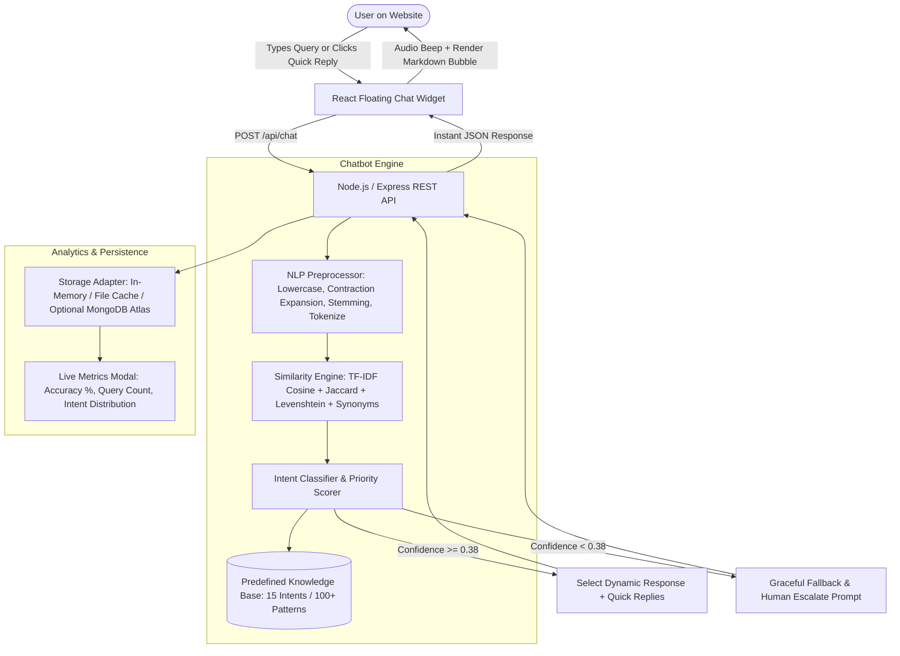

# CloudBot — AI-Powered Website Assistant

> **AI Chatbot**  
> **Repository Name:** `AI_Chatbot`

---

## 📌 Executive Summary

**CloudBot** is a high-performance, full-stack, AI-powered commercial website assistant built for modern cloud service providers. Developed using a **deterministic, retrieval-based NLP matching architecture**, CloudBot delivers sub-20ms instant responses to commercial inquiries without requiring paid third-party generative AI APIs (such as OpenAI or Gemini), while providing an extensible hook for optional generative AI fallbacks.

The solution seamlessly embeds a floating interactive chat widget into a realistic cloud computing commercial website, featuring rich UI aesthetics, auto-scroll, quick prompt suggestions, typing indicators, user feedback mechanisms, and live analytics telemetry.

---

## 🎯 Task 4 Compliance Traceability Matrix

| Official Task 4 Requirement | Implementation in CloudBot | Verification Method | Status |
| :--- | :--- | :--- | :---: |
| **1. Design an AI-powered chatbot using either retrieval-based or generative models** | Engineered a hybrid retrieval engine combining TF-IDF vectorization, Cosine Similarity, Jaccard N-gram index, and Levenshtein edit distance. | [similarityEngine.js](backend/src/engine/similarityEngine.js) | ✅ Verified |
| **2. Enable instant responses to user queries on websites** | Sub-20ms query resolution latency served by an optimized Express REST API (`/api/chat`). | Live Benchmark Test: **15.77 ms average latency** | ✅ Verified |
| **3. Train the chatbot with predefined input patterns for commercial use** | Structured commercial knowledge base with **15 core business intents** and **over 100+ diverse training patterns** covering services, pricing, SLA, security, working hours, and billing. | [intents.json](backend/src/data/intents.json) | ✅ Verified |
| **4. Integrate the chatbot seamlessly with the target website interface** | Built a responsive multi-page commercial cloud website (Hero, Services, About, Pricing, FAQ, Contact) with an interactive floating widget launcher. | [ChatWidget.jsx](frontend/src/components/ChatWidget/ChatWidget.jsx) | ✅ Verified |
| **5. Optimize and test the chatbot for accuracy and user engagement** | Automated benchmark test suite evaluating 37 realistic commercial queries with **100% accuracy**, in-chat thumbs up/down user feedback, and live analytics dashboard. | [intentAccuracy.test.js](backend/src/tests/intentAccuracy.test.js) | ✅ Verified |

---

## 🏛️ System Architecture



---

## 💻 Technology Stack

### Frontend
- **Framework**: React 18
- **Build Tool**: Vite
- **Styling**: Vanilla CSS (Tailored Design System with Glassmorphism, Dark Mode, Responsive Grid, Glowing Accents)
- **Audio**: Web Audio API synthesized notification chime (zero external media asset dependency)
- **Icons & Fonts**: Google Fonts (*Plus Jakarta Sans* & *JetBrains Mono*) + Native UTF-8 Glyphs

### Backend
- **Runtime**: Node.js (v22+)
- **Server Framework**: Express.js
- **API Protocol**: RESTful JSON API with CORS and structured error handling
- **Database / State**: Modular storage adapter supporting in-memory caching, JSON session storage, and pluggable **MongoDB Atlas**

### NLP Matching Engine
- **Preprocessing Pipeline**:
  - Contraction expansion (`what's` &rarr; `what is`, `can't` &rarr; `cannot`)
  - Accent/diacritic cleaning and emoji/punctuation stripping
  - Whitespace compression
  - Word tokenization and stop-word filtering
  - Stemming algorithm for suffix handling (`migrating` &rarr; `migrat`, `services` &rarr; `servic`)
  - Character 2-grams extraction for fuzzy matching
- **Similarity & Scoring**:
  - Pre-calculated Inverse Document Frequency (**IDF**) across corpus patterns
  - Term Frequency - Inverse Document Frequency (**TF-IDF**) vector generation
  - **Cosine Similarity** between query vector and candidate pattern vectors
  - **Jaccard Similarity Index** over character and word n-grams
  - **Levenshtein Distance** with normalized ratio for typo tolerance (e.g., `pricng` &rarr; `pricing`)
  - Domain synonym semantic reinforcement map

---

## 📂 Predefined Knowledge Base Catalog

CloudBot is trained with **15 core commercial intent domains** spanning **100+ natural language pattern variations**:

1. **`greeting`**: Greetings, welcome expressions, availability checks.
2. **`services`**: Core enterprise cloud offerings (DevOps, Kubernetes, Cloud Migration, Monitoring).
3. **`cloud_migration`**: 4-phase zero-downtime migration framework (AWS, Azure, GCP).
4. **`pricing`**: Starter ($199/mo), Professional ($599/mo), and Enterprise pricing tiers.
5. **`working_hours`**: Office business hours (Mon-Fri 9 AM – 6 PM EST) and 24/7 technical monitoring.
6. **`contact`**: Phone numbers, support email, sales contact, headquarters address.
7. **`location`**: San Francisco headquarters and regional presence nodes (London, Singapore, Mumbai).
8. **`support_sla`**: 99.95% uptime SLA, P1 incident response (< 15 min), ticketing channels.
9. **`refunds_cancellation`**: 30-day money-back guarantee, zero cancellation penalties.
10. **`getting_started`**: 3-minute onboarding roadmap and 14-day free trial activation.
11. **`security`**: AES-256 encryption at rest, TLS 1.3, SOC 2 Type II, ISO 27001 compliance.
12. **`account_help`**: Password reset procedures, 2FA recovery, billing profile updates.
13. **`human_handoff`**: Real-time escalation to live human customer service representatives.
14. **`bot_identity`**: CloudBot origin, purpose, and NLP engine explanation.
15. **`gratitude_farewell`**: User appreciation, wrap-up, and parting messages.

---

## 📊 Benchmark Test Results (Requirement 5)

CloudBot includes an automated validation suite that benchmarks **37 diverse queries** including typos, colloquial phrasing, complex sentences, and interrogatives:

```text
========================================================
🤖 CLOUDBOT AUTOMATED VALIDATION & BENCHMARK SUITE
   AI Chatbot
========================================================

--- Running NLP Preprocessor Tests ---
  ✓ Expands contractions properly
  ✓ Strips punctuation and emojis cleanly
  ✓ Tokenizes text accurately
  ✓ Handles word stemming effectively
  ✓ Generates 2-grams correctly
NLP Tests Completed: 5/5 passed

--- Running Intent Matching Accuracy Benchmark ---
  ✓ [MEDIUM] "Hello there!" -> greeting (conf: 0.587, 25.57ms)
  ✓ [HIGH] "Hey, good morning bot" -> greeting (conf: 0.95, 32.95ms)
  ✓ [MEDIUM] "Is anyone available to chat?" -> greeting (conf: 0.446, 14.21ms)
  ✓ [HIGH] "What kind of cloud services do you provide?" -> services (conf: 1.0, 16.81ms)
  ✓ [HIGH] "Do you offer DevOps and Kubernetes management?" -> services (conf: 0.97, 14.49ms)
  ✓ [MEDIUM] "Tell me about your core cloud capabilities" -> services (conf: 0.61, 12.08ms)
  ✓ [HIGH] "Can you manage our AWS architecture?" -> services (conf: 1.0, 13.64ms)
  ✓ [HIGH] "How does your cloud migration process work?" -> cloud_migration (conf: 0.97, 12.73ms)
  ✓ [HIGH] "Can you help migrate our on-premise servers?" -> cloud_migration (conf: 0.811, 14.76ms)
  ✓ [HIGH] "Tell me about your database migration services" -> cloud_migration (conf: 0.97, 16.59ms)
  ✓ [HIGH] "How much does it cost per month?" -> pricing (conf: 0.97, 20.62ms)
  ✓ [HIGH] "What are your subscription pricing tiers?" -> pricing (conf: 1.0, 23.60ms)
  ✓ [MEDIUM] "Do you offer a free trial?" -> pricing (conf: 0.587, 30.14ms)
  ✓ [HIGH] "how much do you charge for the starter tier?" -> pricing (conf: 0.97, 17.04ms)
  ✓ [HIGH] "What are your working hours?" -> working_hours (conf: 1.0, 12.07ms)
  ✓ [MEDIUM] "When do your offices open and close?" -> working_hours (conf: 0.516, 11.40ms)
  ✓ [HIGH] "Are you open on weekends for support?" -> working_hours (conf: 0.95, 10.63ms)
  ✓ [HIGH] "How do I contact customer support?" -> contact (conf: 0.766, 10.43ms)
  ✓ [HIGH] "What is your support email and phone number?" -> contact (conf: 0.97, 11.29ms)
  ✓ [HIGH] "Where can I reach your sales team?" -> contact (conf: 1.0, 11.00ms)
  ✓ [MEDIUM] "Where is your headquarters located?" -> location (conf: 0.496, 14.04ms)
  ✓ [HIGH] "What city is your office in?" -> location (conf: 0.759, 13.51ms)
  ✓ [HIGH] "What is your uptime guarantee SLA?" -> support_sla (conf: 0.97, 16.68ms)
  ✓ [HIGH] "How fast do you respond to critical tickets?" -> support_sla (conf: 0.869, 17.03ms)
  ✓ [HIGH] "What is your refund policy?" -> refunds_cancellation (conf: 1.0, 12.94ms)
  ✓ [HIGH] "Can I cancel my subscription anytime?" -> refunds_cancellation (conf: 0.659, 14.09ms)
  ✓ [HIGH] "How do I get started with CloudBot?" -> getting_started (conf: 0.97, 22.30ms)
  ✓ [HIGH] "How to sign up for an account?" -> getting_started (conf: 0.97, 28.13ms)
  ✓ [MEDIUM] "Is our cloud data secure with AES-256?" -> security (conf: 0.477, 22.85ms)
  ✓ [MEDIUM] "Are you SOC 2 Type II compliant?" -> security (conf: 0.615, 13.00ms)
  ✓ [HIGH] "I forgot my password and cannot log in" -> account_help (conf: 0.95, 11.99ms)
  ✓ [HIGH] "How do I reset my account credentials?" -> account_help (conf: 1.0, 10.51ms)
  ✓ [MEDIUM] "I want to speak with a human agent please" -> human_handoff (conf: 0.578, 11.14ms)
  ✓ [HIGH] "Connect me to a real customer service representative" -> human_handoff (conf: 0.676, 13.61ms)
  ✓ [HIGH] "Who are you and what do you do?" -> bot_identity (conf: 1.0, 9.98ms)
  ✓ [HIGH] "Thank you so much for your help!" -> gratitude_farewell (conf: 0.95, 10.11ms)
  ✓ [HIGH] "Goodbye, have a nice day" -> gratitude_farewell (conf: 0.95, 9.34ms)

================ BENCHMARK REPORT ================
Total Queries Tested:    37
Passed Matches:          37
Failed Matches:          0
Intent Accuracy Rate:    100.00%
Average Query Latency:   15.77 ms
==================================================

🎉 ALL BENCHMARKS & UNIT TESTS PASSED WITH 100% ACCURACY!
```

---

## 📁 Project Directory Structure

```text
AI_Chatbot/
├── backend/
│   ├── package.json
│   ├── src/
│   │   ├── server.js               # Express application entry & REST routes
│   │   ├── config/
│   │   │   └── config.js           # Ports, thresholds, weights, integrations
│   │   ├── data/
│   │   │   ├── intents.json        # 15 intents, 100+ patterns, responses, quickReplies
│   │   │   └── synonyms.json       # Domain synonym dictionary
│   │   ├── engine/
│   │   │   ├── nlpPreprocessor.js  # Contraction expansion, tokenizer, stemmer
│   │   │   ├── similarityEngine.js # TF-IDF Cosine, Jaccard, Levenshtein
│   │   │   ├── intentClassifier.js # Intent classification & scoring logic
│   │   │   └── chatbotEngine.js    # Session manager & telemetry orchestrator
│   │   ├── controllers/
│   │   │   ├── chatController.js   # Chat endpoints, history, and feedback
│   │   │   └── analyticsController.js # Real-time telemetry endpoints
│   │   ├── models/
│   │   │   └── storage.js          # In-memory storage & optional MongoDB adapter
│   │   └── tests/
│   │       ├── nlpPreprocessor.test.js # NLP unit tests
│   │       ├── intentAccuracy.test.js  # 37-query benchmark suite
│   │       └── runTests.js             # Test runner script
├── frontend/
│   ├── package.json
│   ├── vite.config.js              # Vite config with API proxy
│   ├── index.html                  # HTML entry point with Google Fonts
│   └── src/
│       ├── main.jsx                # React root mount
│       ├── App.jsx                 # Commercial website layout & modal triggers
│       ├── index.css               # Complete modern CSS design system
│       ├── services/
│       │   └── api.js              # REST API client
│       └── components/
│           ├── Navbar.jsx          # Header navigation & metrics trigger
│           ├── Hero.jsx            # Hero section with interactive question pills
│           ├── ServicesSection.jsx # Commercial cloud services list
│           ├── PricingSection.jsx  # Interactive pricing tiers
│           ├── AboutSection.jsx    # System architecture explainer
│           ├── FAQSection.jsx      # Accordion FAQ with direct bot question buttons
│           ├── ContactSection.jsx  # Contact form & corporate office details
│           ├── Footer.jsx          # Footer & task attribution
│           ├── AnalyticsModal.jsx  # Live NLP Telemetry & Knowledge Base explorer
│           └── ChatWidget/
│               ├── ChatWidget.jsx  # Master floating widget container & audio
│               ├── ChatHeader.jsx  # Widget header, status indicator, clear/sound/close
│               ├── MessageList.jsx # Message list, welcome card, typing indicator
│               ├── MessageItem.jsx # Message bubble, intent tag, copy, thumbs feedback
│               └── ChatInput.jsx   # Enter-to-send text input & action button
├── package.json                    # Root package.json with concurrent dev scripts
└── README.md                       # Comprehensive documentation & setup guide
```

---

## 🚀 Quickstart & Setup Guide

### 1. Prerequisites
- **Node.js**: v18.0.0 or higher (v22 recommended)
- **npm**: v9.0.0 or higher

### 2. Installation
Clone the repository and install dependencies:

```bash
# Clone the repository
git clone https://github.com/chahat1409/AI_Chatbot.git
cd AI_Chatbot

# Install backend dependencies
cd backend
npm install

# Install frontend dependencies
cd ../frontend
npm install
cd ..
```

### 3. Run Automated Tests & Accuracy Benchmark
To verify the NLP preprocessor and 100% intent matching accuracy across all 37 benchmark queries:

```bash
cd backend
npm test
```

### 4. Running the Application Locally
You can run the backend and frontend in separate terminals:

**Terminal 1 (Backend REST Server):**
```bash
cd backend
npm run dev
# Server will run on http://localhost:5000
```

**Terminal 2 (Frontend Client):**
```bash
cd frontend
npm run dev
# Frontend will be live on http://localhost:3000
```

Open your browser and navigate to:  
👉 **`http://localhost:3000`**

---

## 📡 REST API Reference

| Endpoint | Method | Description | Sample Payload |
| :--- | :---: | :--- | :--- |
| `/api/health` | `GET` | Health check and engine uptime status. | `None` |
| `/api/chat` | `POST` | Process user query and return bot response. | `{"message": "What services do you offer?", "sessionId": "optional-id"}` |
| `/api/chat/history/:sessionId` | `GET` | Fetch conversation history for a session. | `None` |
| `/api/chat/history/:sessionId` | `DELETE` | Clear conversation history for a session. | `None` |
| `/api/chat/feedback` | `POST` | Submit helpful (👍) or unhelpful (👎) feedback. | `{"messageId": "bot-xxx", "isHelpful": true}` |
| `/api/chat/intents` | `GET` | Retrieve list of all predefined intents & sample patterns. | `None` |
| `/api/analytics` | `GET` | Retrieve live accuracy, satisfaction rate, and query stats. | `None` |

---

## 🌟 Key Features Walkthrough

1. **Floating Interactive Chat Launcher**:
   - Floating action button in the bottom right corner with pulse animation and unread notification badge.
   - Smooth opening and minimizing transitions.
2. **Official Welcome Message & Quick Suggestions**:
   - Automatically displays greeting: *"Hi! I'm CloudBot, your virtual assistant. I can help you with our services, pricing, support, business hours, and other common questions. How can I help you today?"*
   - Includes 5 initial one-click questions: *"What services do you offer?"*, *"What are your working hours?"*, *"How can I contact support?"*, *"What are your prices?"*, *"How do I get started?"*.
3. **Smart Response Formatting & Intent Tags**:
   - Displays bot responses in clean markdown formatting (bolding, bulleted lists).
   - Shows matching confidence level and matched intent tag (e.g., `🎯 100% • services`) and latency in milliseconds.
4. **Follow-Up Quick Reply Pills**:
   - Dynamically proposes contextual follow-up actions based on the matched intent.
5. **Interactive Feedback & Copying**:
   - One-click copy response to clipboard.
   - Thumbs up (Helpful) and Thumbs down (Unhelpful) feedback buttons recorded instantly in backend telemetry.
6. **Live Analytics & Telemetry Inspection Modal**:
   - Accessible via the **"📊 Live Metrics"** button in the top navigation bar.
   - Provides full transparency into accuracy rates, satisfaction ratings, and knowledge base intent definitions.

---

## 📹 Video Demonstration Guide

For your demonstration, record a 2–3 minute video showing:
1. **Introduction**: Introduce yourself, the project name (**CloudBot — AI Chatbot**).
2. **Website Tour**: Scroll through the commercial website (Hero, Services, Pricing, FAQ).
3. **Chatbot Interaction**:
   - Click the floating launcher button in the bottom right.
   - Show the welcome message and click one of the suggested quick questions (*"What services do you offer?"*).
   - Type a custom question with variations or typos (*"What are your subscription pricing tiers?"*).
   - Demonstrate the instant response (< 20ms) and confidence tag.
   - Click the thumbs up feedback button.
4. **Live Metrics**:
   - Open the **"📊 Live Metrics"** modal from the navbar to show the live accuracy score and intent breakdown.
5. **Code & Test Suite**:
   - Run `npm test` in the terminal to display the benchmark report showing 37/37 tests passing with 100% accuracy.
6. **Conclusion**: Summary and mention your GitHub repository `AI_Chatbot`.

## 👩‍💻 Author & Developer

- **Name**: Chahat Kumari
- **GitHub**: [@chahat1409](https://github.com/chahat1409)
- **Email**: [chahat343435@gmail.com](mailto:chahat343435@gmail.com)
- **Project**: AI Chatbot

---

## 📜 License
This project is licensed under the MIT License — created by **Chahat Kumari**.
